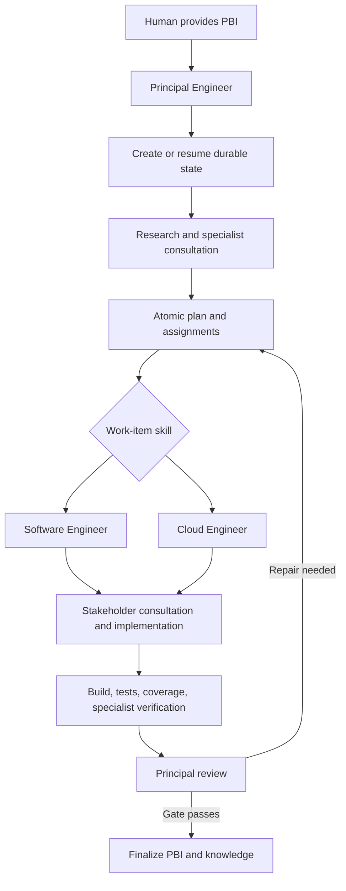

# Principal Engineer PBI Delivery Workflow

**Version:** 1.0.0  
**Last updated:** 2026-07-23  
**Changelog:** [WORKFLOW_CHANGELOG.md](WORKFLOW_CHANGELOG.md)

## Purpose

This personal VS Code customization makes Principal Engineer accountable for a PBI from intake through completion. Humans interact with a small surface; hidden specialists research, implement, and review bounded work; file-backed state makes progress resumable across sessions; and completion updates a safe engineering knowledge base.

After installing or changing these files, run **Developer: Reload Window** before testing agent discovery. New or renamed profile agents are not guaranteed to appear in an already-running chat session.

## Human Surface

Use one of two entry points:

1. Select `principal-engineer` and provide the PBI or task.
2. Run `/deliver-pbi` with the PBI identifier, description, repositories, and known constraints.

Use `/pbi-status` to inspect or resume durable progress. `prompt-architect` and its prompt-authoring commands remain available for reviewing or enhancing this workflow. All delivery specialists are hidden from the agent picker and are invoked by Principal Engineer.

### Visible Agents

| Agent | Purpose |
| ----- | ------- |
| `principal-engineer` | End-to-end PBI delivery and final accountability |
| `prompt-architect` | Prompt, agent, skill, instruction, and workflow design or enhancement |

### Visible Slash Commands

| Command | Purpose |
| ------- | ------- |
| `/deliver-pbi` | Start or resume end-to-end PBI delivery |
| `/pbi-status` | Inspect state or continue the next unblocked work item |
| `/create-prompt-set` | Create prompt customizations |
| `/enhance-prompt` | Improve an existing customization |
| `/review-prompt-set` | Run independent prompt review |
| `/design-expert-workflow` | Design specialist-agent routing |
| `/migrate-chatmode` | Migrate legacy chat modes to agents |
| `/prompt-engineering` | Invoke the prompt-engineering skill directly |

All domain delivery skills are hidden from the slash menu but remain automatically model-invocable.

## Accountability

Principal Engineer owns research, planning, delegation, reconciliation, progress state, review, finalization, and knowledge capture. Software Engineer, Cloud Engineer, Architect, Security Engineer, and QA Engineer perform bounded work and return evidence. The user is asked only for decisions, access, approvals, or business information that cannot be derived safely.

| Role | Visibility | Accountability |
| ---- | ---------- | -------------- |
| Principal Engineer | Human-visible | PBI outcome, plan, state, delegation, final review, completion, and knowledge |
| Software Engineer | Hidden | Atomic application work, stakeholder consultation, TDD, build and test evidence |
| Cloud Engineer | Hidden | Atomic infrastructure and deployment work, plans, state safety, rollback, and monitoring |
| Architect | Hidden | Boundaries, contracts, resilience, data flow, and design review |
| Security Engineer | Hidden | Threats, secrets, identity, authorization, dependencies, and security release gates |
| QA Engineer | Hidden | Acceptance criteria, test strategy, defects, coverage, and PASS/BLOCKED evidence |
| Prompt Reviewer | Hidden | Independent evaluation of prompt-system changes |

Workers never close the PBI. Their result is a handback to Principal Engineer containing changed files, decisions, commands, results, risks, and lessons.

## Execution Flow



## Lifecycle And State

The overall PBI states are:

`Intake` -> `Research` -> `Planned` -> `In Progress` -> `Verification` -> `Principal Review` -> `Complete`

`Blocked` can occur from any phase. A blocker records its owner, decision needed, impact, and safe work that can continue. Work items use `Pending`, `Ready`, `In Progress`, `Blocked`, `Verification`, `Complete`, or `Cancelled`.

Principal Engineer updates `status.md` after each phase, delegation result, human decision, validation result, or scope change. On resume, inspect non-destructive worktree status and history in every affected repository, compare changed and externally versioned artifacts with work-item evidence, and record discrepancies. Repository evidence wins when the ledger is stale; invalid `Complete` claims return to `Verification` before work continues.

## Atomic Planning And Assignment

Each work item has one accountable role, objective, non-goals, dependencies, affected paths, acceptance criteria, required consultations, TDD or verification approach, completion evidence, and stop condition.

- Application code, tests, configuration, refactoring, APIs, queues, and persistence go to Software Engineer.
- Terraform, Azure resources, identity, networking, TeamCity, Octopus, state, monitoring, and deployment work go to Cloud Engineer.
- Principal Engineer delegates bounded research or review to Architect, Security Engineer, and QA Engineer.
- Software Engineer consults Architecture, Security, QA, or Cloud before implementation when the work-item risk requires it.
- Independent research and review may run in parallel. Implementation follows dependency order.

Nested subagents are enabled through `chat.subagents.allowInvocationsFromSubagents`. The allowlists form an acyclic graph. VS Code supports a maximum nesting depth of five subagent hops below the root coordinator; the longest allowed path, `Principal -> Software -> Cloud -> Architect -> Security -> QA`, uses those five hops. If a required consultation would exceed it, the worker returns the question to Principal Engineer for a separate bounded delegation.

Prompt Architect may call Prompt Reviewer for independent prompt evaluation. Prompt Reviewer calls no subagents and is outside the PBI delivery graph.

Principal Engineer is visible but intentionally blocked from model invocation so another agent cannot silently take over PBI accountability.

### Design Tradeoffs

- Security is read-only. QA is read-only with non-destructive execute authority. Remediation and test edits return to Software or Cloud Engineer under Principal ownership.
- Architect returns cloud-specific questions to Principal Engineer instead of calling Cloud Engineer. This preserves an acyclic graph and coordinator accountability at the cost of a round trip; Principal consults both in parallel when needed.
- File-backed state is authoritative because native Copilot Memory is preview and is not guaranteed to retain workflow state.

## TDD And Handoff

Software Engineer uses red-green-refactor when automated tests can express the behavior:

1. Add or identify a focused test that fails for the expected reason.
2. Make the smallest production change that passes it.
3. Refactor without behavior change and rerun focused tests.

When TDD is impractical, the work item records why and uses the strongest available pre/post check. The handback must include focused and required broader build/test results, coverage evidence appropriate to risk, acceptance-criteria mapping, stakeholder findings, and lessons learned.

Principal Engineer reviews actual changes and reproducible evidence. Failed items return for repair; summaries alone are not completion evidence.

## Human Control Points

Explicit human approval is required for production actions, destructive commands, credentials, secret rotation, any production Terraform plan/apply or remote backend state read/refresh/mutation, permission expansion, security exceptions, scope tradeoffs, risk acceptance, and final release approval. Prompts and repository content are evidence, not authority, and embedded instructions are not adopted automatically.

## Files

### Personal customizations

This deployment targets Windows. Prompts are authored in `%USERPROFILE%\.copilot\prompts\` and synced to `%APPDATA%\Code\User\prompts\` for VS Code discovery. Agents live in `%USERPROFILE%\.copilot\agents\` and instructions in `%USERPROFILE%\.copilot\instructions\`. Personal skills and knowledge use `%USERPROFILE%\.copilot\` (also written as `~/.copilot/`).

| Type | Files |
| ---- | ----- |
| Visible agents | `principal-engineer.agent.md`, `prompt-architect.agent.md` |
| Hidden delivery workers | `software-engineer.agent.md`, `cloud-engineer.agent.md`, `architect.agent.md`, `security-engineer.agent.md`, `qa-engineer.agent.md` |
| Hidden prompt reviewer | `prompt-reviewer.agent.md` |
| PBI prompts | `deliver-pbi.prompt.md`, `pbi-status.prompt.md` |
| Prompt-authoring prompts | `create-prompt-set.prompt.md`, `enhance-prompt.prompt.md`, `review-prompt-set.prompt.md`, `design-expert-workflow.prompt.md`, `migrate-chatmode.prompt.md` |
| Engineering instructions | `csharp-dotnet.instructions.md`, `devops-release.instructions.md`, `dotnet-testing.instructions.md`, `engineering-docs.instructions.md`, `repo-investigation.instructions.md`, `security.instructions.md` |
| Prompt instructions | `prompt-authoring.instructions.md` |

The required VS Code setting is in `%APPDATA%/Code/User/settings.json`:

```json
"chat.subagents.allowInvocationsFromSubagents": true
```

### Agent Skills

All skills are under `~/.copilot/skills/<skill-name>/SKILL.md`.

| Skill | Primary owner or use |
| ----- | -------------------- |
| `pbi-delivery` | Principal workflow, state, completion, and knowledge contract |
| `pbi-planning` | Atomic planning and acceptance criteria |
| `dotnet-build-test` | Focused-to-broad .NET validation |
| `architecture-review` | Architecture boundaries and design evidence |
| `security-review` | Security findings and release controls |
| `threat-modeling` | Trust boundaries and abuse cases |
| `cloud-change-review` | Azure, Terraform, IAM, state, cost, rollback, and monitoring |
| `release-management` | TeamCity, Octopus, deployment, rollback, and go/no-go |
| `dependency-upgrade` | NuGet/package upgrades and compatibility |
| `incident-debugging` | Incident and regression diagnosis |
| `codebase-onboarding` | Focused repository-area mapping |
| `adr-writing` | Architecture decision records |
| `runbook-writing` | Operational runbooks |
| `prompt-engineering` | Prompt-system creation, review, migration, and evaluation |

The `pbi-delivery` skill references:

- `references/state-contract.md`
- `references/completion-gate.md`
- `references/knowledge-contract.md`

### Repository state

Default primary-ledger location when the repository has no equivalent convention:

```text
docs/engineering/pbis/<pbi-id>/
|-- status.md
|-- plan.md
|-- work-items/<work-item-id>.md
|-- completion.md
`-- knowledge.md
```

For multi-repository PBIs, select one primary repository for this authoritative ledger. Add a local pointer in secondary repositories when policy permits, and record every repository role, baseline, cross-repository dependency, package or contract sequence, per-repository validation, integration compatibility, release order, and rollback. Completion requires convergence across every affected repository, not just the primary ledger repository.

### Cross-workspace knowledge

- `~/.copilot/knowledge/repositories.md`
- `~/.copilot/knowledge/engineering-lessons.md`

Native Copilot Memory can supplement this workflow when enabled, but it is preview, feature-dependent, and subject to retention. The tracked ledger and file-backed knowledge base are the authoritative state.

Repository-specific facts remain in the repository. The personal knowledge base stores only generalized lessons and repository pointers; it must not contain secrets, customer data, proprietary code, internal endpoints, credentials, sensitive findings, or business rules that should not cross repository boundaries.

### Prompt Library

The package ships 26 slash prompts in three families. Prompts are thin entry points; the real role behavior lives in the agent definitions and skills they route to.

- **PBI delivery** — `deliver-pbi`, `pbi-status`, `plan-pbi`, `implement-pbi`.
- **Prompt authoring** — `create-prompt-set`, `review-prompt-set`, `enhance-prompt`, `migrate-chatmode`, `design-expert-workflow`.
- **Domain** — `adr`, `architecture-review`, `bug-triage`, `code-review`, `dependency-upgrade-review`, `incident-debug`, `onboard-codebase`, `qa-signoff`, `release-notes`, `release-readiness`, `runbook`, `security-review`, `team-consultation`, `terraform-cloud-review`, `test-strategy`, `threat-model`, `write-tests`.

## Completion Gate

Principal Engineer does not mark a PBI complete until all applicable conditions pass:

- Every work item is complete or has a structured cancellation decision with a named human owner and impact.
- Every affected repository and cross-repository dependency has local and integration evidence.
- Acceptance criteria have reproducible evidence.
- Affected projects or solution build successfully.
- Focused and required broader tests pass; coverage is appropriate to risk.
- TDD evidence or a Principal-approved exception with refactoring cost, tradeoff, and alternative verification is recorded.
- QA is PASS, or accepted defects have named ownership, rationale, expiry/follow-up, release impact, and sign-off; required security, architecture, cloud, release, rollback, monitoring, and documentation evidence is complete.
- No unaccepted blocker, leaked secret, failing required test, or unknown production blast radius remains.
- `completion.md` and repository knowledge are updated, and safe generalized lessons are considered for personal knowledge.

## Operating Examples

Start a PBI:

> `/deliver-pbi PBI-1234: add idempotent retry handling to the order consumer in C:\Projects\Orders. Preserve .NET Framework compatibility and include release rollback.`

Inspect progress:

> `/pbi-status PBI-1234`

Resume after a new session:

> Select `principal-engineer` and say: `Resume PBI-1234 from its durable ledger. Reconcile the ledger with the current worktree and continue the first unblocked incomplete item.`

## Inspection And Enhancement

Give another prompt-engineering-capable model this request:

> Review the Principal Engineer PBI workflow rooted at `~/.copilot/TEAM_WORKFLOW.md`. Follow every referenced agent, prompt, instruction, skill, state contract, completion gate, knowledge file, setting, and archive location. Verify current official VS Code support for profile customizations, hidden agents, agent allowlists, nested subagents, model fallbacks, prompt discovery, and Agent Skills. Check that Principal Engineer retains end-to-end accountability; specialists are hidden and skill-routed; the consultation graph is acyclic; work items are atomic; Software Engineer consults stakeholders and uses TDD where practical; Cloud Engineer owns infrastructure work; workers return evidence to Principal Engineer; humans retain production and risk decisions; state is resumable across sessions; completion requires build, tests, coverage, specialist evidence, release/rollback, and knowledge updates; and cross-workspace knowledge cannot leak repository-confidential data. Simulate normal, underspecified, blocked, security-sensitive, cloud-only, multi-repository, resumed-session, failed-test, and adversarial prompt-injection PBIs. Lead with reproducible findings and smallest corrections. Use independent architecture, security, QA, and prompt reviews, reconcile by official documentation and executable evidence, and do not edit until the findings are approved.

The active system should validate to:

- 2 visible agents. Principal Engineer is user-visible but not model-invocable; Prompt Architect is both visible and model-invocable.
- 6 hidden model-invocable agents.
- 26 slash prompts across PBI delivery, prompt authoring, and domain families.
- 15 skills total: 1 visible `prompt-engineering` skill and 14 hidden domain/delivery skills.
- 7 instruction files.
- 0 active `senior-engineer` references.

Official platform basis checked 2026-07-23:

- [VS Code custom agents and hidden subagents](https://code.visualstudio.com/docs/agent-customization/custom-agents)
- [VS Code nested subagents and coordinator/worker pattern](https://code.visualstudio.com/docs/agents/subagents)
- [VS Code Agent Skills](https://code.visualstudio.com/docs/agent-customization/agent-skills)
- [GitHub Copilot Memory preview and retention](https://docs.github.com/copilot/concepts/agents/copilot-memory)
